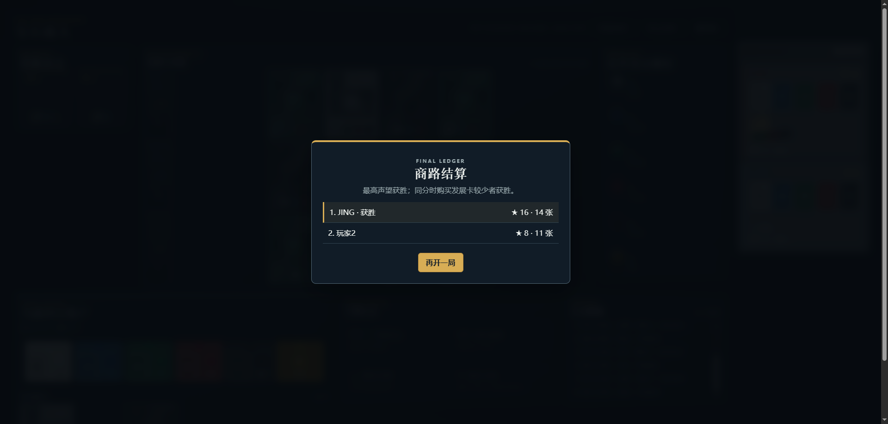
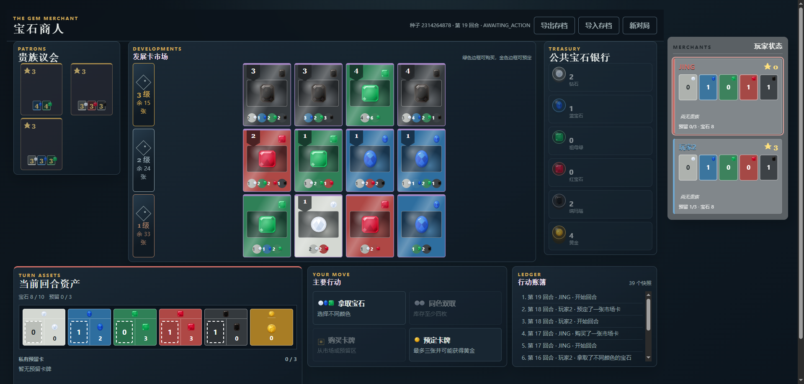
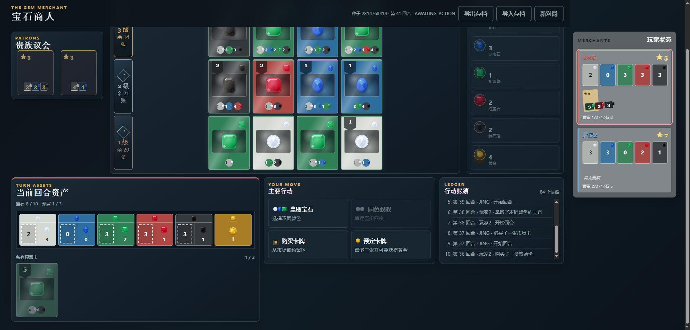

# 宝石商人

《宝石商人》是一个可直接在浏览器中运行的本地策略桌游项目。玩家从公共宝石池取得资源、购买发展卡取得永久折扣与声望、争取贵族青睐，并在最后一轮以最高声望获胜。

项目采用纯 HTML、CSS 与 JavaScript（原生 ES Modules）实现：零第三方依赖、零构建步骤，支持 2–4 名真人与 AI 混合对局，以及全 AI 自动模拟。



## 游戏来源：璀璨宝石

本项目的核心规则参考桌游《璀璨宝石》（Splendor）：通过宝石筹码、发展卡、贵族与声望组成轻量但富有取舍的引擎构筑玩法。

《璀璨宝石》及 Splendor 为其权利人拥有的作品与商标。本项目是非官方的学习与实现作品，不是官方产品，也不包含官方牌表或官方美术资源。

## 快速开始

访问：https://jing200327-cmyk.github.io/-/

要求：Node.js 20+（仅用于启动本地静态服务器与测试）。

```powershell
npm start
```

在浏览器访问 <http://127.0.0.1:4173>。开局时可以为每个席位选择真人、随机 AI、贪心 AI 或目标规划 AI。

```powershell
npm test
npm run simulate -- --games=1000 --seed=20260722
npm run simulate:10000
```

## 游戏宝石美术设计

宝石既是资源，也是整个桌面视觉系统的导航锚点。六种资源使用独立 SVG 图标，并在市场卡、公共池、玩家资产槽、支付预览与贵族条件中保持一致：

| 属性 | 宝石图标 | 视觉方向 |
| --- | --- | --- |
| 白色 | Diamond | 明亮、清透、低饱和银白 |
| 蓝色 | Sapphire | 冷静、深邃的蓝宝石 |
| 绿色 | Emerald | 饱满、自然的祖母绿 |
| 红色 | Ruby | 高对比、热烈的红宝石 |
| 黑色 | Onyx | 稳重、深色的缟玛瑙 |
| 黄金 | Gold | 预留卡获得的金币资源 |

### 图标展示

<table>
  <tr>
    <td align="center"><strong>白色 · Diamond</strong><br></td>
    <td align="center"><strong>蓝色 · Sapphire</strong><br></td>
    <td align="center"><strong>绿色 · Emerald</strong><br></td>
  </tr>
  <tr>
    <td align="center"><strong>红色 · Ruby</strong><br></td>
    <td align="center"><strong>黑色 · Onyx</strong><br></td>
    <td align="center"><strong>黄金 · Gold</strong><br></td>
  </tr>
</table>



发展卡以对应属性色为主题底色，中心放置宝石图标与高光；费用以深色圆形筹码呈现，数字在圆心，宝石图标附着在圆边。这样能让资源类型、永久折扣与支付需求在一次扫视中完成识别。

## 贵族与发展卡的后续设计

当前项目使用随机生成的发展卡，便于验证规则、AI 与自动模拟。后续美术和内容设计将沿用“颜色即功能”的原则：

- **发展卡**：按一级、二级、三级建立稳定的价值曲线；一级强调折扣和小成本，三级提供高声望与明确的终局推动力。
- **发展卡主题**：在保留宝石主视觉的前提下，逐步加入矿脉、商路、工坊与珠宝工艺等局部插画，不能影响费用与折扣的可读性。
- **贵族卡**：采用更宽短的卡片比例，贵族条件在卡片下部以迷你属性槽展示；后续可加入地区、家族纹章与剪影，但贵族条件必须优先可读。
- **内容平衡**：固定牌表引入前，持续使用无界面模拟器统计卡色比例、贵族频率、预留率、黄金使用率与不同 AI 的胜率。



## 游戏布局设计

桌面按“公共信息居中、私人信息靠近玩家”的原则组织：

- 左侧为贵族议会；中央为三级发展卡市场；右侧为公共宝石池。
- 桌面宽屏下，玩家状态栏固定在页面右侧，便于持续观察所有玩家的分数、折扣与贵族。
- 底部为当前玩家的六色资产槽、私有预留卡与主要行动；行动账簿为内置滚动区，避免多轮记录拉长页面。
- 市场卡、贵族卡、宝石图标和玩家资产槽共用同一套颜色与图标语言，减少学习成本。

## 游戏规则

### 主要行动

每个回合只能执行一个主要行动：

1. 拿取三种不同颜色的普通宝石。
2. 当公共池该颜色至少有 4 枚时，拿取两枚同色普通宝石。
3. 购买一张市场发展卡。
4. 购买一张自己的预留发展卡。
5. 预留一张市场发展卡，或从牌堆顶盲抽预留一张；若黄金仍在公共池，获得一枚黄金。

预留上限为 3 张。已购买发展卡提供永久折扣；购买时优先支付同色宝石，不足部分可以用黄金补齐。

### 回合结束流程

每次主要行动统一执行以下流程：

```text
执行主要行动 → 处理 10 枚宝石上限 → 检查贵族 → 检查终局 → 切换玩家
```

- 持有超过 10 枚宝石时，必须归还恰好超出的数量；归还期间不能购买或预留。
- 贵族条件只计算已购买发展卡的永久折扣，不计算普通宝石或黄金。
- 满足一位贵族时自动获得；同时满足多位贵族时选择其中一位；每回合最多获得一位。

### 终局与胜负

当玩家在回合结束时达到 15 声望，触发最后一轮。对局继续到所有玩家拥有相同的行动次数。

最终以声望最高者获胜；同分时，购买发展卡较少者获胜，贵族不计入发展卡数量；仍相同则并列。

完整规则见 [docs/RULES.md](./docs/RULES.md)。

## 技术架构

```text
js/engine/       纯数据规则引擎，不读取 DOM
js/ai/           随机、贪心、目标规划 AI
js/simulation/   无界面对局与统计
js/ui/           渲染、输入和状态展示
tests/           规则测试与浏览器冒烟测试
```

AI 与真人通过同一套结构化 Action 调用规则引擎。动作日志和状态快照可用于复盘、调试、导入导出以及后续联网验证。

## 浏览器测试入口

- [基础流程](http://127.0.0.1:4173/tests/browser-smoke.html)
- [AI 对局](http://127.0.0.1:4173/tests/browser-ai-smoke.html)
- [市场卡草稿](http://127.0.0.1:4173/tests/browser-card-draft-smoke.html)
- [桌面布局](http://127.0.0.1:4173/tests/browser-layout-smoke.html)
- [首屏布局](http://127.0.0.1:4173/tests/browser-first-fold-smoke.html)

## 版本状态

当前版本：V0.3.0

- 已完成：规则状态机、宝石上限、贵族选择、最后一轮、动作日志与快照、AI、无界面模拟。
- 正在迭代：桌面视觉、固定牌表、美术主题与更完整的回放体验。
